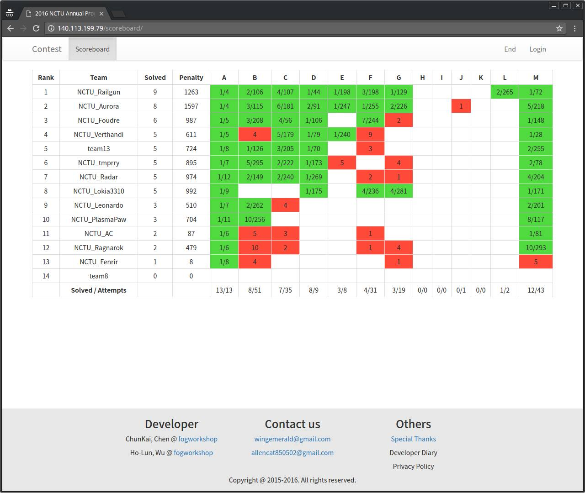
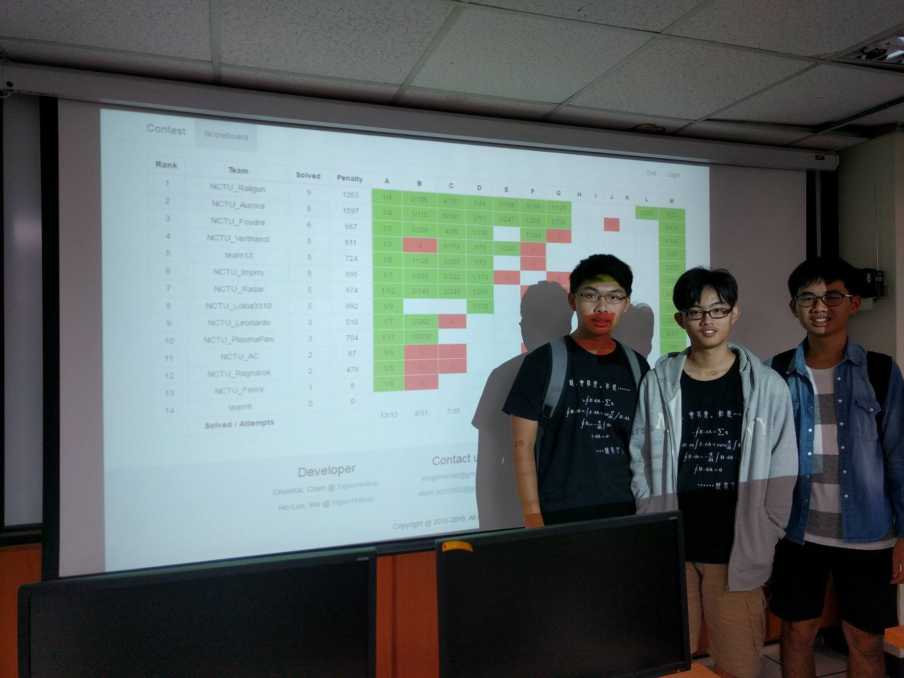

# 交大年度賽 (2016/08/10)

[題目](https://bitbucket.org/mzshieh/nctu-annual-2016/)官方題目連結

## 題解
## A
輸入後 sort 求最大三項總和

## B
	
## C

## D
高斯消去法找
[ x0^0 , x0^1 , x0^2 , ... , x0^(n-1) ]
[ x1^0 , x1^1 , x1^2 , ... , x1^(n-1) ]
[ x2^0 , x2^1 , x2^2 , ... , x2^(n-1) ]
.
.
.
[ xn-1^0 , xn-1^1 , xn-1^2 , ... , xn-1^(n-1) ]
的反方陣 R

R * [ f0 ]
	[ f1 ]
	[ f2 ]
	  .
	  .
	  .
	[ fn-1]
得到的矩陣就是答案

## M

## result

